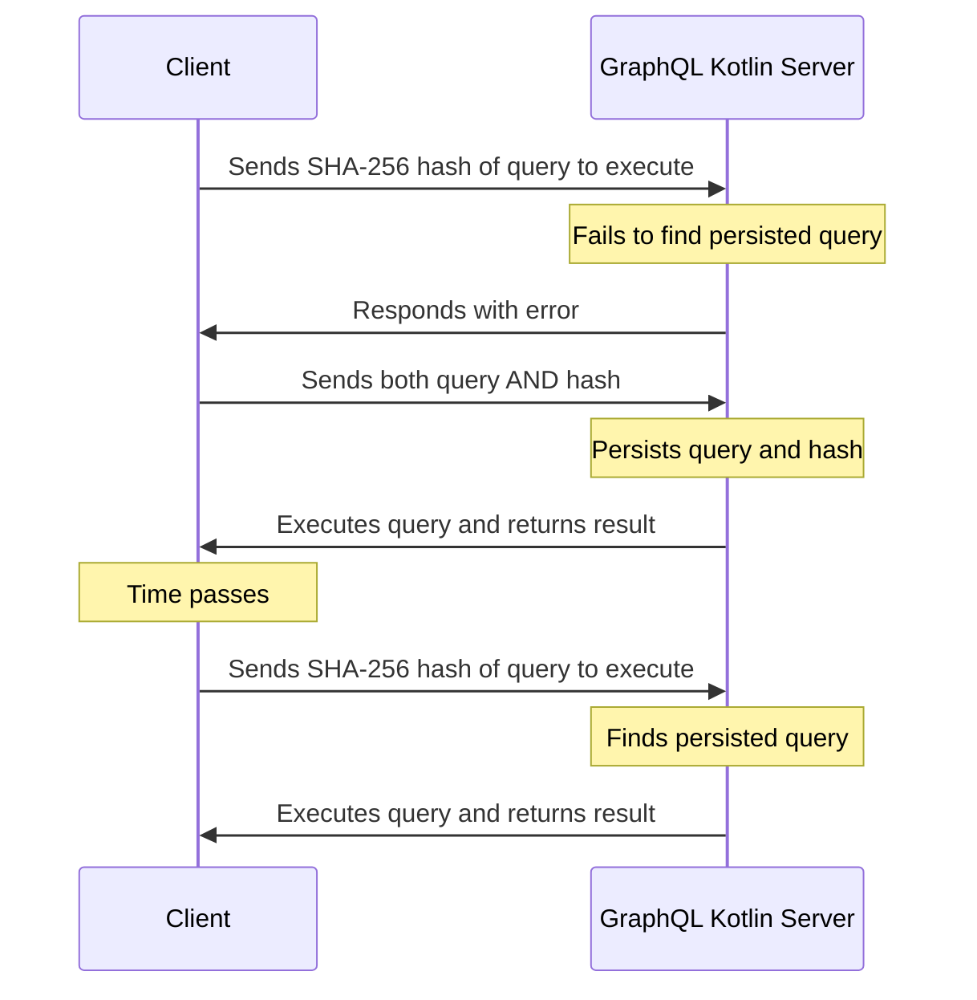

# GraphQL Kotlin Automatic Persisted Queries Support (APQ)
[](https://search.maven.org/search?q=g:%22com.expediagroup%22%20AND%20a:%22graphql-kotlin-automatic-persisted-queries%22)
[](https://www.javadoc.io/doc/com.expediagroup/graphql-kotlin-automatic-persisted-queries)

`graphql-kotlin-automatic-persisted-queries` is the `graphql-kotlin` implementation of Automatic Persisted Queries (APQ).

[APQ is technique created by Apollo](https://www.apollographql.com/docs/apollo-server/performance/apq/) to improve
GraphQL network performance with zero build-time configuration by sending smaller [GraphQL HTTP requests](https://github.com/graphql/graphql-over-http/blob/main/spec/GraphQLOverHTTP.md),
a smaller request payload reduces bandwidth utilization and speeds up GraphQL client loading times.

A persisted query is a query string that is cached on a GraphQL server, along with a unique identifier (SHA-256 hash), that way,
Clients can send this identifier instead of his corresponding query which will drastically reduce the request size.

To persist a query, a GraphQL Server must first receive it from a client, then, subsequent requests can just include the identifier
instead of the query.



The `APQ` implementation of `graphql-kotlin` relies on the [graphql-java PreparsedDocumentProvider](https://github.com/graphql-java/graphql-java/blob/master/src/main/java/graphql/execution/preparsed/PreparsedDocumentProvider.java)
which is an interface that allows clients to cache GraphQL Documents (AST) that were parsed and validated.

The `AutomaticPersistedQueriesProvider` class implements `PreparsedDocumentProvider` and contains all the logic required to fulfil the APQ spec.

## Install it

Using a JVM dependency manager, link `graphql-kotlin-automatic-persisted-queries` to your project.

With Maven:

```xml
<dependency>
  <groupId>com.expediagroup</groupId>
  <artifactId>graphql-kotlin-automatic-persisted-queries</artifactId>
  <version>${latestVersion}</version>
</dependency>
```

With Gradle (example using kts):

```kotlin
implementation("com.expediagroup:graphql-kotlin-automatic-persisted-queries:$latestVersion")
```

## Use it

1. Create an instance of `AutomaticPersistedQueriesProvider` by specifying as a constructor argument an implementation of an
`AutomaticPersistedQueriesCache` interface, which is the place where the queries will be persisted by their unique identifier.

**Note:** `graphql-kotlin` provides a default in-memory cache implementation of `AutomaticPersistedQueriesCache` called `DefaultAutomaticPersistedQueriesCache`.

2. Provide the instance of `AutomaticPersistedQueriesProvider` to the [GraphQLBuilder preparsedDocumentProvider method](https://github.com/graphql-java/graphql-java/blob/master/src/main/java/graphql/GraphQL.java#L261).

**Note:** In order to take full advantage of APQ it's recommended to use a different cache mechanism like REDIS.

```kotlin
val schema = "your schema"
val runtimeWiring =  RuntimeWiring.newRuntimeWiring().build() // your runtime wiring
val automaticPersistedQueryProvider = AutomaticPersistedQueriesProvider(DefaultAutomaticPersistedQueriesCache())

val graphQL = GraphQL
    .newGraphQL(SchemaGenerator().makeExecutableSchema(SchemaParser().parse(schema), runtimeWiring))
    .preparsedDocumentProvider(automaticPersistedQueryProvider)
    .build()
```
