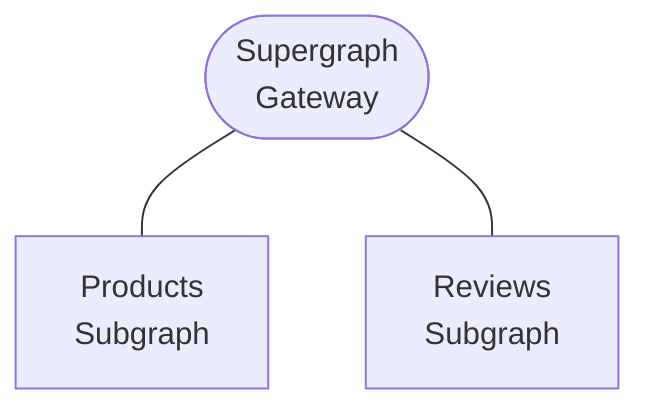

# GraphQL Kotlin Federated Schema Generator
[](https://search.maven.org/search?q=g:%22com.expediagroup%22%20AND%20a:%22graphql-kotlin-federation%22)
[](https://www.javadoc.io/doc/com.expediagroup/graphql-kotlin-federation)

`graphql-kotlin-federation` extends the functionality of `graphql-kotlin-schema-generator` and allows you to easily
generate federated GraphQL schemas directly from the code. Federated schemas rely on a number of directives to
instrument the behavior of the underlying graph, see [the documentation](https://expediagroup.github.io/graphql-kotlin).
Once all the federated objects are annotated, you will also have to configure corresponding [FederatedTypeResolver]s
that are used to instantiate federated objects and finally generate the schema using `toFederatedSchema` function
([link](https://github.com/ExpediaGroup/graphql-kotlin/blob/master/generator/graphql-kotlin-federation/src/main/kotlin/com/expediagroup/graphql/generator/federation/toFederatedSchema.kt#L34)).



>NOTE: `graphql-kotlin-federation` libraries allow you to build individual GraphQL services, aka Subgraphs. This library does not
>provide capability to build a GraphQL Gateway, aka Supergraph.

See more

* [Federation Spec](https://www.apollographql.com/docs/apollo-server/federation/federation-spec/)

## Installation

Using a JVM dependency manager, link `graphql-kotlin-federation` to your project.

With Maven:

```xml
<dependency>
  <groupId>com.expediagroup</groupId>
  <artifactId>graphql-kotlin-federation</artifactId>
  <version>${latestVersion}</version>
</dependency>
```

With Gradle:

```kotlin
implementation("com.expediagroup", "graphql-kotlin-federation", latestVersion)
```

## Usage

In order to generate valid federated schemas, you will need to annotate both your base schema and the one extending it. Federated Gateway (e.g. Apollo) will then combine the individual graphs to form single federated graph.

### Federation v1 vs Federation v2

Federation v2 is an evolution of the Federation spec to make it more powerful, flexible and easier to adapt. While v1 and
v2 schemas are similar in many ways, Federation v2 relaxes some of the constraints and adds additional capabilities. See
[Apollo documentation](https://www.apollographql.com/docs/federation/federation-2/new-in-federation-2/) for details.

By default, `graphql-kotlin-federation` library will generate Federation v1 compatible schema. In order to generate v2
compatible schema you have to explicitly opt-in by specifying `optInFederationV2 = true` on your instance of `FederatedSchemaGeneratorHooks`.

```kotlin
val myHooks = FederatedSchemaGeneratorHooks(resolvers = myFederatedResolvers, optInFederationV2 = true)
val myConfig = FederatedSchemaGeneratorConfig(
  supportedPackages = "com.example",
  hooks = myHooks
)

toFederatedSchema(
  config = myConfig,
  queries = listOf(TopLevelObject(MyQuery()))
)
```

>NOTE: Federation v2 compatible schemas, can be generated using `graphql-kotlin-spring-server` by configuring `graphql.federation.optInV2 = true` property.

### Base Schema (Products Subgraph)

Base schema defines GraphQL types that will be extended by schemas exposed by other GraphQL services. In the example below, we define base `Product` type with `id` and `description` fields. `id` is the primary key that uniquely identifies the `Product` type object and is specified in `@key` directive.

```kotlin
@KeyDirective(fields = FieldSet("id"))
data class Product(val id: Int, val description: String)

class ProductQuery {
  fun product(id: Int): Product? {
    // grabs product from a data source, might return null
  }
}

// Generate the schema
val federatedTypeRegistry = FederatedTypeRegistry(emptyMap())
val config = FederatedSchemaGeneratorConfig(supportedPackages = listOf("org.example"), hooks = FederatedSchemaGeneratorHooks(federatedTypeRegistry))
val queries = listOf(TopLevelObject(ProductQuery()))

toFederatedSchema(config, queries)
```

Generates the following schema with additional federated types

```graphql
schema {
  query: Query
}

union _Entity = Product

type Product @key(fields : "id") {
  description: Int!
  id: String!
}

type Query {
  _entities(representations: [_Any!]!): [_Entity]!
  _service: _Service!
  product(id: Int!): Product!
}

type _Service {
  sdl: String!
}
```

### Extended Schema (Reviews Subgraph)

Extended federated GraphQL schemas provide additional functionality to the types already exposed by other GraphQL services.
In the example below, `Product` type is extended to add new `reviews` field to it. Primary key needed to instantiate
the `Product` type (i.e. `id`) has to match the `@key` definition on the base type.
Since primary keys are defined on the base type and are only referenced from the extended type,
all the fields that are part of the field set specified in `@key` directive have to be marked as `@external`.

```kotlin
@KeyDirective(fields = FieldSet("id"))
@ExtendsDirective
data class Product(@ExternalDirective val id: Int) {
    fun reviews(): List<Review> {
        // returns list of product reviews
    }
}

data class Review(val reviewId: String, val text: String)

// Generate the schema
val productResolver = object: FederatedTypeSuspendResolver<Product> {
    override fun resolve(
        environment: DataFetchingEnvironment,
        representation: Map<String, Any>
    ): Product {
        val id = representation["id"]?.toString()?.toIntOrNull()
        // instantiate product using id
    }
}
val federatedTypeRegistry = FederatedTypeRegistry(mapOf("Product" to productResolver))
val config = FederatedSchemaGeneratorConfig(supportedPackages = listOf("org.example"), hooks = FederatedSchemaGeneratorHooks(federatedTypeRegistry))

toFederatedSchema(config)
```

Generates the following federated schema

```graphql
schema {
  query: Query
}

union _Entity = Product

type Product @extends @key(fields : "id") {
  id: Int! @external
  reviews: [Review!]!
}

type Query {
  _entities(representations: [_Any!]!): [_Entity]!
  _service: _Service!
}

type Review {
  reviewId: String!
  text: String!
}

type _Service {
  sdl: String!
}
```

Federated Gateway will then combine the schemas from the individual services to generate single schema.

### Federated Supergraph schema

```graphql
schema {
  query: Query
}

type Product {
  description: String!
  id: String!
  reviews: [Review!]!
}

type Review {
  reviewId: String!
  text: String!
}

type Query {
  product(id: String!): Product!
}
```

## Documentation

There are more examples in our [documentation](https://expediagroup.github.io/graphql-kotlin),
or you can view the [javadocs](https://www.javadoc.io/doc/com.expediagroup/graphql-kotlin-federation) for all published versions.

If you have a question about something you can not find in our documentation or javadocs, feel free to [create an issue](https://github.com/ExpediaGroup/graphql-kotlin/issues) and tag it with the question label.
