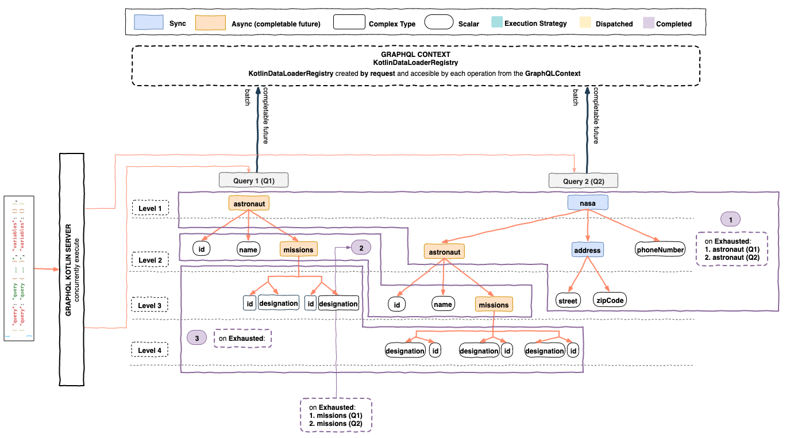

`graphql-kotlin-dataloader-instrumentation` is set of custom [Instrumentations](https://www.graphql-java.com/documentation/instrumentation/)
that will calculate when is the right moment to dispatch `KotlinDataLoader`s across single and batch GraphQL operations.

These custom instrumentations follow the similar approach as the default [DataLoaderDispatcherInstrumentation](https://github.com/graphql-java/graphql-java/blob/master/src/main/java/graphql/execution/instrumentation/dataloader/DataLoaderDispatcherInstrumentation.java)
from `graphql-java`, the main difference is that regular instrumentations apply to a single `ExecutionInput` aka [GraphQL Operation](https://www.graphql-java.com/documentation/execution#queries),
whereas these custom instrumentations applies to multiple GraphQL operations (say a BatchRequest) and stores its state in the `GraphQLContext`.
allowing batching and deduplication of transactions across those multiple GraphQL operations.

The `graphql-kotlin-dataloader-instrumentation` module contains 2 custom `DataLoader` instrumentations:

1. **DataLoaderLevelDispatchedInstrumentation**

   Dispatches all data loaders when a certain **Level** when a certain **Level**of all **ExecutionInputs** sharing a
   GraphQLContext was dispatched (all DataFetchers were invoked).

2. **DataLoaderSyncExecutionExhaustedInstrumentation**

   Dispatches all data loaders when all synchronous execution paths across all operations are exhausted. Synchronous execution path
   is considered exhausted when all currently processed data fetchers were either resolved to a scalar or dispatched a `CompletableFuture`.

## Dispatching by level

 Consider the following example:


The `DataLoaderLevelDispatchedInstrumentation` tracks the state of all `ExecutionInputs` across operations. When a certain
field dispatches, it will check if all fields across all operations for a particular level were dispatched and if the condition is met,
it will dispatch all the data loaders.

### Usage

```kotlin
GraphQL
    .instrumentation(DataLoaderLevelDispatchedInstrumentation())
    // configure schema, type wiring, etc.
    .build()

val queries = [
    """
      query Query1 {
        nasa {
          astronaut(id: 1) {
            name
          }
        }
      }
    """,
    """
      query Query1 {
        nasa {
          astronaut(id: 2) {
            name
          }
        }
      }
    """
]

val graphQLContext = mapOf(
    KotlinDataLoaderRegistry::class to kotlinDataLoaderRegistry,
    SyncExecutionExhaustedState::class to ExecutionLevelDispatchedState(queries.size)
)

val result1 = graphQL.executeAsync(ExecutionInput.newExecutionInput(queries[0]).graphQLContext(graphQLContext).build())
val result2 = graphQL.executeAsync(ExecutionInput.newExecutionInput(queries[1]).graphQLContext(graphQLContext).build())
```

In this example, the `astronaut` DataFetcher uses a `AstronautDataLoader` which will be dispatched when Level 1 of those 2 operations
is dispatched, causing the `AstronautDataLoader` to load 2 astronauts.

You can find additional examples in our [unit tests](https://github.com/ExpediaGroup/graphql-kotlin/blob/master/executions/graphql-kotlin-dataloader-instrumentation/src/test/kotlin/com/expediagroup/graphql/dataloader/instrumentation/level/DataLoaderLevelDispatchedInstrumentationTest.kt).

### Limitations

This instrumentation is a good option if your GraphQL Server will receive a batched request with operations of the same type,
in those cases batching by level is enough, however, this solution is far from being the most optimal as we don't necessarily want to dispatch by level.

## Dispatching by execution exhaustion

The most optimal time to dispatch all data loaders is when all possible synchronous execution paths across all batch
operations were exhausted. Synchronous execution path is considered exhausted (or completed) when all currently processed
data fetchers were either resolved to a scalar or a future promise.

Let's analyze how GraphQL execution works, but first lets check some GraphQL concepts:

**DataFetcher**

Each field in GraphQL has a `DataFetcher` associated with it, some fields will use specialized `DataFetcher`s
that knows how to go to a database or make a network request to get field information while most simply take
data from the returned memory objects.

Note: `DataFetcher`s are some times called "resolvers" in other graphql implementations.


**Execution Strategy**

The process of finding values for a list of fields from the GraphQL Query, using a recursive strategy.

Now consider following GraphQL Query and the ExecutionStrategies:

```graphql
query ComplexQuery {
    astronaut(id: 1) { # async
        id
        name
    }
    nasa { #sync
        astronaut(id: 2) { # async
            id
            name
        }
        address { # sync
            street
            zipCode
        }
        phoneNumber
    }
}
```

**The order of execution of the query will be:**
1. Start an `ExecutionStrategy` for the `root` field of the query, to concurrently resolve `astronaut` and `nasa` fields.
    * `astronaut` **DataFetcher** will return a `CompletableFuture<Astronaut>` so we can consider this path exhausted.
    * `nasa` **DataFetcher** will return a `Nasa` object, so we can descend more that path.
2. Start an `ExecutionStrategy` for the `nasa` field of the `root` field of the query to concurrently resolve `astronaut`, `address` and `phoneNumber`.
    * `astronaut` **DataFetcher** will return a `CompletableFuture<Astronaut>` so we can consider this path exhausted
    * `address` **DataFetcher** will return an object, so we can descend more that path.
    * `phoneNumber` **DataFetcher** will return a scalar, so we can consider this path exhausted.
3. Start an `ExecutionStrategy` for the `address` field of the `nasa` field to concurrently resolve `street` and `zipCode`.
    * `street` **DataFetcher** will return a scalar, so we can consider this path exhausted.
    * `zipCode` **DataFetcher** will return a scalar, so we can consider this path exhausted.

By default, each GraphQL operation is processed independently of each other. Multiple operations can be processed
together as if they were single GraphQL request if they are part of the same batch request and server
is using one of the `graphql-kotlin-dataloader-instrumentation`s.



### Usage
```kotlin
GraphQL
    .instrumentation(DataLoaderLevelDispatchedInstrumentation())
    // configure schema, type wiring, etc.
    .build()

val queries = [
    """
      query Query1 {
        astronaut(id: 1) {
            id
            name
        }
      }
    """,
    """
      query Query1 {
        nasa {
          astronaut(id: 2) {
            id
            name
          }
          address {
            street
            zipCode
        }
      }
    """
]

val graphQLContext = mapOf(
    KotlinDataLoaderRegistry::class to kotlinDataLoaderRegistry,
    SyncExecutionExhaustedState::class to SyncExecutionExhaustedState(queries.size, kotlinDataLoaderRegistry)
)

val result1 = graphQL.executeAsync(ExecutionInput.newExecutionInput(queries[0]).graphQLContext(graphQLContext).build())
val result2 = graphQL.executeAsync(ExecutionInput.newExecutionInput(queries[1]).graphQLContext(graphQLContext).build())
```

You can find additional examples in our [unit tests](https://github.com/ExpediaGroup/graphql-kotlin/blob/master/executions/graphql-kotlin-dataloader-instrumentation/src/test/kotlin/com/expediagroup/graphql/dataloader/instrumentation/syncexhaustion/DataLoaderSyncExecutionExhaustedInstrumentationTest.kt).


If you are using [graphql-kotlin-spring-server](../spring-server/spring-overview.mdx), you can decide which instrumentation to use through configurations
and spring will do the autoconfiguration for you, check [configuration properties of spring server](../spring-server/spring-properties.md).
