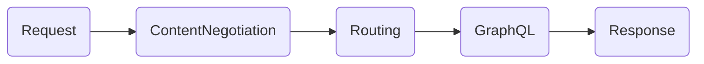

Ktor HTTP request/response can be intercepted by installing various plugins to your module or by intercepting specific
phases of application call pipeline. By installing `graphql-kotlin-ktor-server` plugin you will configure following pipeline



## Installing Additional Plugins

You can install additional plugins in your module next to the `GraphQL` module. See [Ktor docs](https://ktor.io/docs/plugins.html)
for details.

```kotlin
fun Application.myModule() {
    // install additional plugins
    install(CORS) { ... }
    install(Authentication) { ... }

    // install graphql plugin
    install(GraphQL) {
        schema {
            packages = listOf("com.example")
            queries = listOf(TestQuery())
        }
    }
    // install authenticated GraphQL routes
    install(Routing) {
        authenticate("auth-basic") {
            graphQLPostRoute()
        }
    }
}
```

## Intercepting Pipeline Phases

You can intercept requests/responses in various phases of application call pipeline by specifying an interceptor. See
[Ktor docs](https://ktor.io/docs/custom-plugins-base-api.html#call-handling) for details.

```kotlin
fun Application.myModule() {
    install(GraphQL) {
        schema {
            packages = listOf("com.example")
            queries = listOf(TestQuery())
        }
    }
    install(Routing) {
        graphQLPostRoute()
    }

    intercept(ApplicationCallPipeline.Monitoring) {
        call.request.origin.apply {
            println("Request URL: $scheme://$localHost:$localPort$uri")
        }
    }
}
```
