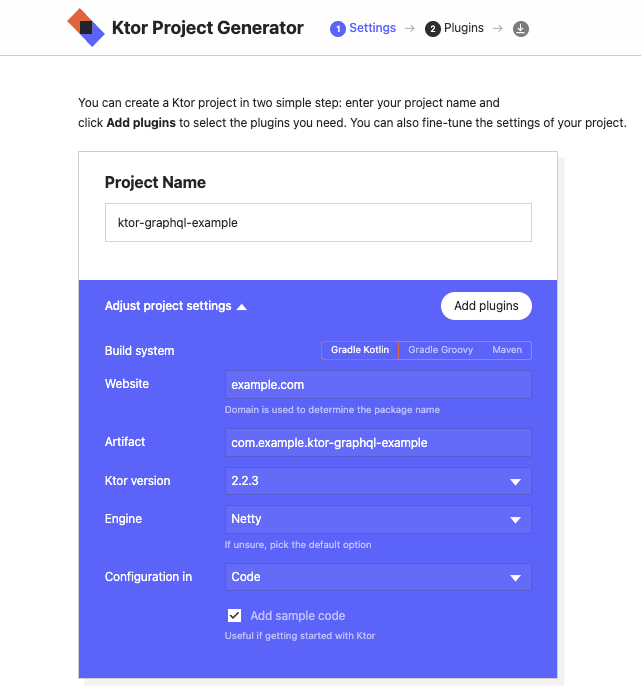

import Tabs from '@theme/Tabs';
import TabItem from '@theme/TabItem';

[graphql-kotlin-ktor-server](https://github.com/ExpediaGroup/graphql-kotlin/tree/master/servers/graphql-kotlin-ktor-server)
is a Ktor Server Plugin that simplifies setup of your GraphQL server.

## Setup

The simplest way to create a new Ktor Server app is by generating one using https://start.ktor.io/.



Once you get the sample application setup locally, you will need to add `graphql-kotlin-ktor-server` dependency:

<Tabs
  defaultValue="gradle"
  values={[
    { label: 'Gradle Kotlin', value: 'gradle' },
    { label: 'Maven', value: 'maven' }
  ]
}>

<TabItem value="gradle">

```kotlin
implementation("com.expediagroup", "graphql-kotlin-ktor-server", latestVersion)
```

</TabItem>
<TabItem value="maven">

```xml
<dependency>
    <groupId>com.expediagroup</groupId>
    <artifactId>graphql-kotlin-ktor-server</artifactId>
    <version>${latestVersion}</version>
</dependency>
```

</TabItem>
</Tabs>

## Configuration

`graphql-kotlin-ktor-server` is a Ktor Server Plugin and you to manually install it in your [module](https://ktor.io/docs/modules.html).

```kotlin
class HelloWorldQuery : Query {
    fun hello(): String = "Hello World!"
}

fun Application.graphQLModule() {
    install(GraphQL) {
        schema {
            packages = listOf("com.example")
            queries = listOf(
                HelloWorldQuery()
            )
        }
    }
    install(Routing) {
        graphQLPostRoute()
    }
}
```

If you use `EngineMain` to start your Ktor server, you can specify your module configuration in your `application.conf` (default)
or `application.yaml` (requires additional `ktor-server-config-yaml` dependency) file.

```
ktor {
    application {
        modules = [ com.example.ApplicationKt.graphQLModule ]
    }
}
```

## Content Negotiation

:::caution
`graphql-kotlin-ktor-server` automatically configures `ContentNegotiation` plugin with [Jackson](https://github.com/FasterXML/jackson)
serialization for GraphQL GET/POST routes. `kotlinx-serialization` is currently not supported.
:::

## Routing

`graphql-kotlin-ktor-server` plugin DOES NOT automatically configure any routes. You need to explicitly configure `Routing`
plugin with GraphQL routes. This allows you to selectively enable routes and wrap them in some additional logic (e.g. `Authentication`).

GraphQL plugin provides following `Route` extension functions

- `Route#graphQLGetRoute` - GraphQL route for processing GET query requests
- `Route#graphQLPostRoute` - GraphQL route for processing POST query requests
- `Route#graphQLSDLRoute` - GraphQL route for exposing schema in Schema Definition Language (SDL) format
- `Route#graphiQLRoute` - GraphQL route for exposing [an official IDE](https://github.com/graphql/graphiql) from the GraphQL Foundation
