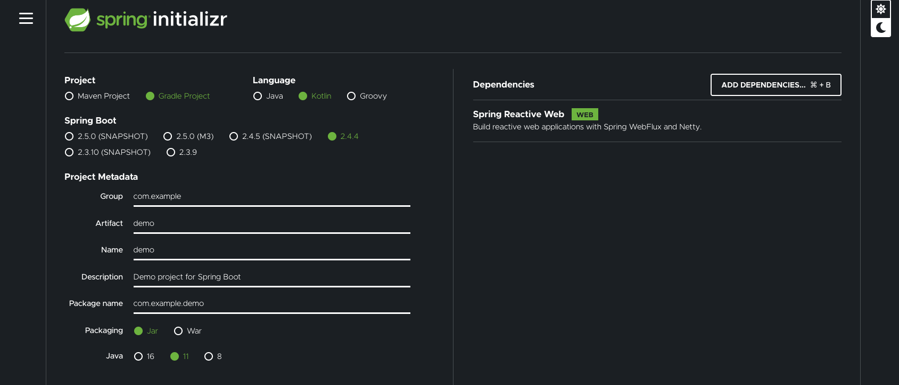

[graphql-kotlin-spring-server](https://github.com/ExpediaGroup/graphql-kotlin/tree/3.x.x/graphql-kotlin-spring-server)
is a Spring Boot auto-configuration library that automatically configures beans required to start up a reactive GraphQL
web server.

## WebFlux vs WebMVC

This library is built on a [Spring WebFlux (reactive)](https://docs.spring.io/spring/docs/current/spring-framework-reference/web-reactive.html) stack which is a non-blocking alternative to a traditional [Spring Web MVC (servlet)](https://docs.spring.io/spring/docs/current/spring-framework-reference/web.html) based stack.
Since both frameworks utilize different threading models they cannot and should not be intermixed.
When building a GraphQL server using `graphql-kotlin-spring-server` all your queries and mutations should follow one of the supported [asynchronous execution models](../schema-generator/execution/async-models.md).

## Setup

The simplest way to create a new Kotlin Spring Boot app is by generating one using [Spring Initializr.](https://start.spring.io/)



Once you get the sample application setup locally, you will need to add `graphql-kotlin-spring-server` dependency:

With Maven:

```xml
<dependency>
  <groupId>com.expediagroup</groupId>
  <artifactId>graphql-kotlin-spring-server</artifactId>
  <version>${latestVersion}</version>
</dependency>
```

With Gradle:

```kotlin
implementation("com.expediagroup", "graphql-kotlin-spring-server", latestVersion)
```

## Configuration

At a minimum, in order for `graphql-kotlin-spring-server` to automatically configure your GraphQL web server you need to
specify a list of supported packages that can be scanned for exposing your schema objects through reflections.

You can do this through the spring application config or by overriding the `SchemaGeneratorConfig` bean. See customization below.

```yaml
graphql:
  packages:
    - "com.your.package"
```

## Writing Schema Code
In order to expose your queries, mutations and/or subscriptions in the GraphQL schema you need to implement
corresponding marker interface and they will be automatically picked up by `graphql-kotlin-spring-server`
auto-configuration library.

```kotlin
@Component
class MyAwesomeQuery : Query {
  fun myAwesomeQuery(): Widget { ... }
}

@Component
class MyAwesomeMutation : Mutation {
  fun myAwesomeMutation(widget: Widget): Widget { ... }
}

@Component
class MyAwesomeSubscription : Subscription {
  fun myAwesomeSubscription(): Publisher<Widget> { ... }
}

data class Widget(val id: Int, val value: String)
```

will result in a Spring Boot reactive GraphQL web application with following schema.

```graphql
schema {
  query: Query
  mutation: Mutation
  subscription: Subscription
}

type Query {
  myAwesomeQuery: Widget!
}

type Mutation {
  myAwesomeMutation(widget: WidgetInput!): Widget!
}

type Subscription {
  myAwesomeSubscription: Widget!
}

type Widget {
  id: Int!
  value: String!
}

input WidgetInput {
  id: Int!
  value: String!
}
```

## Default Routes

Your newly created GraphQL server starts up with following preconfigured default routes:

* **/graphql** - GraphQL server endpoint used for processing queries and mutations
* **/subscriptions** - GraphQL server endpoint used for processing subscriptions
* **/sdl** - Convenience endpoint that returns current schema in Schema Definition Language format
* **/playground** - Prisma Labs [GraphQL Playground IDE](https://github.com/prisma-labs/graphql-playground) endpoint
