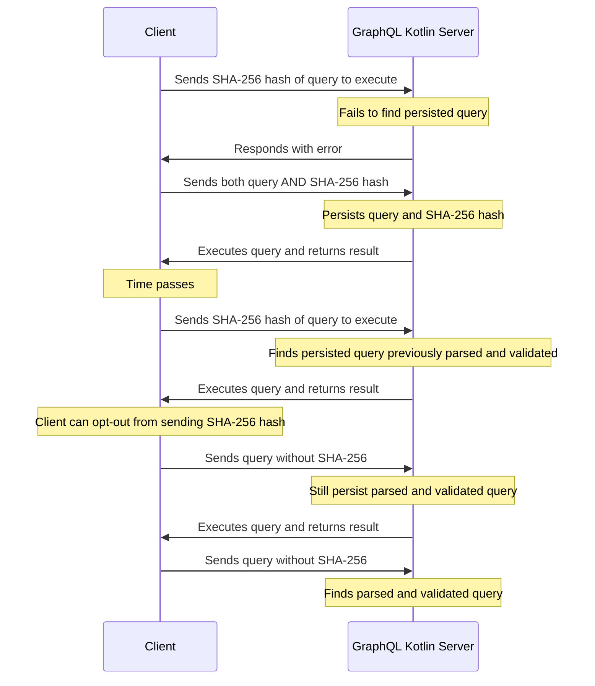

[APQ is technique created by Apollo](https://www.apollographql.com/docs/apollo-server/performance/apq/) to improve
GraphQL network performance with zero build-time configuration by sending smaller [GraphQL HTTP requests](https://github.com/graphql/graphql-over-http/blob/main/spec/GraphQLOverHTTP.md).
A smaller request payload reduces bandwidth utilization and speeds up GraphQL Client loading times.

A persisted query is a parsed and validated query document that is cached on a GraphQL Server, along with a unique identifier (SHA-256 hash).
This way clients can send this identifier instead of the corresponding query which will drastically reduce the request size.

To persist a query, a GraphQL Server must first receive it from a Client, then, subsequent requests can just include the identifier
instead of the query.



## AutomaticPersistedQueriesProvider

To support APQ we have created `AutomaticPersistedQueriesProvider` which is an implementation of
the [graphql-java PreparsedDocumentProvider](https://github.com/graphql-java/graphql-java/blob/master/src/main/java/graphql/execution/preparsed/PreparsedDocumentProvider.java),
which is the interface that allows caching for parsed and validated GraphQL Documents (AST).

`AutomaticPersistedQueriesProvider` requires the implementation of `AutomaticPersistedQueriesCache` as a constructor argument.
`AutomaticPersistedQueriesCache` is an interface that specifies the contract of how to retrieve documents.

**Note:** `graphql-kotlin-automatic-persisted-queries` provides a default in-memory cache implementation of `AutomaticPersistedQueriesCache`
called `DefaultAutomaticPersistedQueriesCache`. In order to take full advantage of Automatic Persisted Queries, it's recommended
to use an external cache mechanism like Redis.

### Usage in GraphQL Kotlin Server

Provide an instance of `AutomaticPersistedQueryProvider` in the GraphQL engine builder `preparsedDocumentProvider` method:

```kotlin
val schema = "your schema"
val runtimeWiring =  RuntimeWiring.newRuntimeWiring().build() // your runtime wiring
val automaticPersistedQueryProvider = AutomaticPersistedQueriesProvider(DefaultAutomaticPersistedQueriesCache())

val graphQL = GraphQL
    .newGraphQL(SchemaGenerator().makeExecutableSchema(SchemaParser().parse(schema), runtimeWiring))
    .preparsedDocumentProvider(automaticPersistedQueryProvider)
    .build()
```

:::info
`graphql-kotlin-spring-server` provides convenient integration of Automatic Persisted Queries functionality through simple configuration.
Automatic Persisted Queries can be enabled by configuring following properties:
```yaml
graphql:
  automaticPersistedQueries:
   enabled: true
```
:::

If you want to implement a different cache mechanism using Caffeine or REDIS you can just simply provide a Spring Bean and the
autoconfigured `AutomaticPersistedQueryProvider` will use your custom implementation of the cache.

```kotlin
class REDISAutomaticPersistedQueriesCache : AutomaticPersistedQueriesCache {
    override fun getOrElse(key: String, supplier: () -> PreparsedDocumentEntry): CompletableFuture<PreparsedDocumentEntry> {
        // your implementation
    }
}

@Configuration
class ApplicationConfiguration {
    @Bean
    fun redisAutomaticPersistedQueriesCache(): PreparsedDocumentProvider = REDISAutomaticPersistedQueriesCache()
}
```
### Usage in Clients

Clients that want to use APQ will need to calculate the unique identifier (SHA-256 hash) of a query and send it
in the extension section of a [GraphQL HTTP request](https://github.com/graphql/graphql-over-http/blob/main/spec/GraphQLOverHTTP.md#json-encoding)

Example Payload:

```json
{
  "variables": {
    "foo": "bar"
  },
  "extensions": {
    "persistedQuery": {
      "version": 1,
      "sha256Hash": "ecf4edb46db40b5132295c0291d62fb65d6759a9eedfa4d5d612dd5ec54a6b38"
    }
  }
}
```

As seen, in an APQ request, the query field of the request payload is optional.

### Errors

All errors are going to be provided in the `errors` array in the JSON Response:

1. `PersistedQueryNotFound` if `query` was not provided and preparsed document could not be found in the cache using the provided `sha256Hash`
the GraphQL Error response will be:
```json
{
  "errors": [
    {
      "message": "PersistedQueryNotFound",
      "extensions": {
        "persistedQueryId": "ecf4edb46db40b5132295c0291d62fb65d6759a9eedfa4d5d612dd5ec54a6b38",
        "classification": "PersistedQueryNotFound"
      }
    }
  ]
}
```

2. `PersistedQueryIdInvalid` if `query` was provided but the provided `sha256Hash` does not match with the `query`
the GraphQL Error response will be:
```json
{
  "errors": [
    {
      "message": "PersistedQueryIdInvalid",
      "extensions": {
        "persistedQueryId": "ecf4edb46db40b5132295c0291d62fb65d6759a9eedfa4d5d612dd5ec54a6b38",
        "classification": "PersistedQueryIdInvalid"
      }
    }
  ]
}
```
