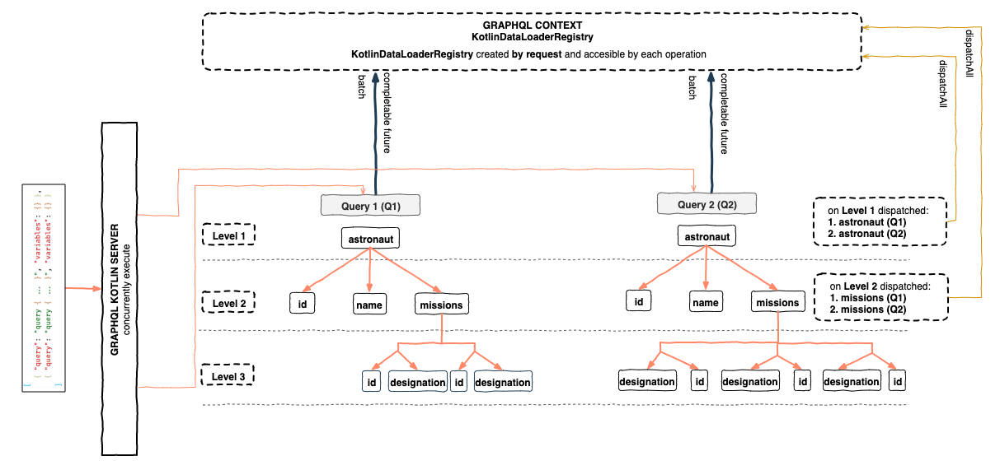
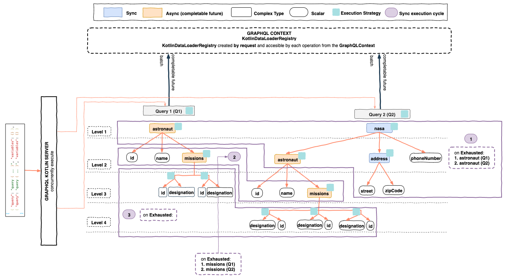

import Tabs from '@theme/Tabs';
import TabItem from '@theme/TabItem';

`graphql-kotlin-dataloader-instrumentation` is set of custom [Instrumentations](https://www.graphql-java.com/documentation/instrumentation/)
that will calculate when is the right moment to dispatch `KotlinDataLoader`s across single and batch GraphQL operations.

These custom instrumentations follow the similar approach as the default [DataLoaderDispatcherInstrumentation](https://github.com/graphql-java/graphql-java/blob/master/src/main/java/graphql/execution/instrumentation/dataloader/DataLoaderDispatcherInstrumentation.java)
from `graphql-java`, the main difference is that regular instrumentations apply to a single `ExecutionInput` aka [GraphQL Operation](https://www.graphql-java.com/documentation/execution#queries),
whereas these custom instrumentations apply to multiple GraphQL operations (say a BatchRequest) and stores their state in the `GraphQLContext`
allowing batching and deduplication of transactions across those multiple GraphQL operations.

By default, each GraphQL operation is processed independently of each other. Multiple operations can be processed
together as if they were single GraphQL request if they are part of the same batch request.

The `graphql-kotlin-dataloader-instrumentation` module contains 2 custom `DataLoader` instrumentations.

## Dispatching by level

The `DataLoaderLevelDispatchedInstrumentation` tracks the state of all `ExecutionInputs` across operations. When a certain
field dispatches, it will check if all fields across all operations for a particular level were dispatched and if the condition is met,
it will dispatch all the data loaders.

### Example

You can find additional examples in our [unit tests](https://github.com/ExpediaGroup/graphql-kotlin/blob/master/executions/graphql-kotlin-dataloader-instrumentation/src/test/kotlin/com/expediagroup/graphql/dataloader/instrumentation/level/DataLoaderLevelDispatchedInstrumentationTest.kt).

<Tabs
    defaultValue="by-level-queries"
    values={[
        { label: 'Queries', value: 'by-level-queries' },
        { label: 'Execution', value: 'by-level-execution' }
    ]}
>

<TabItem value="by-level-queries">

```graphql
query Q1 {
    astronaut(id: 1) { # async
        id
        name
        missions { # async
            id
            designation
        }
    }
}

query Q2 {
    astronaut(id: 2) { # async
        id
        name
        missions { # async
            id
            designation
        }
    }
}
```

</TabItem>
<TabItem value="by-level-execution">



* The `astronaut` `DataFetcher` uses a `AstronautDataLoader` which will be dispatched when **Level 1** of those 2 operations
is dispatched, causing the `AstronautDataLoader` to load 2 astronauts.
* The `missions` `DataFetcher` uses a `MissionsByAstronautDataLoader` which will be dispatched when **Level 2** of those 2 operations
is dispatched, causing the `MissionsByAstronautDataLoader` to load 2 lists of missions by astronaut.

</TabItem>
</Tabs>

### Usage

In order to enable batching by level, you need to configure your GraphQL instance with the `DataLoaderLevelDispatchedInstrumentation`.

```kotlin
val graphQL = GraphQL.Builder()
    .doNotAddDefaultInstrumentations()
    .instrumentation(DataLoaderLevelDispatchedInstrumentation())
    // configure schema, type wiring, etc.
    .build()
```

This data loader instrumentation relies on a global state object that should be stored in the GraphQL context map

```kotlin
val graphQLContext = mapOf(
    SyncExecutionExhaustedState::class to ExecutionLevelDispatchedState(queries.size)
)
```

:::info
`graphql-kotlin-spring-server` provides convenient integration of batch loader functionality through simple configuration.
Batching by level can be enabled by configuring following properties:
```yaml
graphql:
  batching:
   enabled: true
   strategy: LEVEL_DISPATCHED
```
:::

### Limitations

This instrumentation is a good option if your **GraphQLServer** will receive a batched request with operations of the same type,
in those cases batching by level is enough, however, this solution is far from being the most optimal as we don't necessarily want to dispatch by level.

## Dispatching by synchronous execution exhaustion

The most optimal time to dispatch all data loaders is when all possible synchronous execution paths across all batch
operations were exhausted. Synchronous execution path is considered exhausted (or completed) when all currently processed
data fetchers were either resolved to a scalar or a future promise.

Let's analyze how GraphQL execution works, but first lets check some GraphQL concepts:

**DataFetcher**

Each field in GraphQL has a resolver aka `DataFetcher` associated with it, some fields will use specialized `DataFetcher`s
that knows how to go to a database or make a network request to get field information while most simply take
data from the returned memory objects.


**Execution Strategy**

The process of finding values for a list of fields from the GraphQL Query, using a recursive strategy.

### Example

You can find additional examples in our [unit tests](https://github.com/ExpediaGroup/graphql-kotlin/blob/master/executions/graphql-kotlin-dataloader-instrumentation/src/test/kotlin/com/expediagroup/graphql/dataloader/instrumentation/syncexhaustion/DataLoaderSyncExecutionExhaustedInstrumentationTest.kt).

<Tabs
    defaultValue="by-sync-exhaustion-queries"
    values={[
        { label: 'Queries', value: 'by-sync-exhaustion-queries' },
        { label: 'Execution', value: 'by-sync-exhaustion-execution' }
    ]}
>
<TabItem value='by-sync-exhaustion-queries'>

```graphql
query Q1 {
    astronaut(id: 1) { # async
        id
        name
        missions { # async
            id
            designation
        }
    }
}

query Q2 {
    nasa { #sync
        astronaut(id: 2) { # async
            id
            name
            missions { # async
                id
                designation
            }
        }
        address { # sync
            street
            zipCode
        }
        phoneNumber
    }
}
```
</TabItem>
<TabItem value='by-sync-exhaustion-execution'>



**The order of execution of the queries will be:**

***for Q1***
1. Start an `ExecutionStrategy` for the `root` field of the query, to concurrently resolve `astronaut` field.
    * `astronaut` **DataFetcher** will invoke the `AstronautDataLoader` and will return a `CompletableFuture<Astronaut>` so we can consider this path exhausted.

***for Q2***
1. Start an `ExecutionStrategy` for the `root` field of the query, to concurrently resolve `nasa` field.
    * `nasa` **DataFetcher** will synchronously return a `Nasa` object, so we can descend more that path.
2. Start an `ExecutionStrategy` for the `nasa` field of the `root` field of the query to concurrently resolve `astronaut`, `address` and `phoneNumber`.
    * `astronaut` **DataFetcher**  will invoke the `AstronautDataLoader` and will return a `CompletableFuture<Astronaut>` so we can consider this path exhausted
    * `address` **DataFetcher** will synchronously return an `Address` object, so we can descend more that path.
    * `phoneNumber` **DataFetcher** will return a scalar, so we can consider this path exhausted.
3. Start an `ExecutionStrategy` for the `address` field of the `nasa` field to concurrently resolve `street` and `zipCode`.
    * `street` **DataFetcher** will return a scalar, so we can consider this path exhausted.
    * `zipCode` **DataFetcher** will return a scalar, so we can consider this path exhausted.

**At this point we can consider the synchronous execution exhausted and the `AstronautDataLoader` has 2 keys to be dispatched,
if we proceed dispatching all data loaders the execution will continue as following:**

***for Q1***
1. Start and `ExecutionStrategy` for the `astronaut` field of the `root` field of the query to concurrently resolve `id`, `name` and `mission` fields.
    * `id` **DataFetcher** will return a scalar, so we can consider this path exhausted.
    * `name` **DataFetcher** will return a scalar, so we can consider this path exhausted.
    * `missions` **DataFetcher** will invoke the `MissionsByAstronautDataLoader` and will return a `CompletableFuture<List<Mission>>` so we can consider this path exhausted.

***for Q2***
1. Start and `ExecutionStrategy` for the `astronaut` field of the `nasa` field of the query to concurrently resolve `id`, `name` and `mission` fields.
    * `id` **DataFetcher** will return a scalar, so we can consider this path exhausted.
    * `name` **DataFetcher** will return a scalar, so we can consider this path exhausted.
    * `missions` **DataFetcher** will invoke the `MissionsByAstronautDataLoader` and will return a `CompletableFuture<List<Mission>>` so we can consider this path exhausted.

**At this point we can consider the synchronous execution exhausted and the `MissionsByAstronautDataLoader` has 2 keys to be dispatched,
if we proceed dispatching all data loaders the execution will continue to just resolve scalar fields.**

</TabItem>
</Tabs>

### Usage

In order to enable batching by synchronous execution exhaustion, you need to configure your GraphQL instance with the `DataLoaderLevelDispatchedInstrumentation`.

```kotlin
val graphQL = GraphQL.Builder()
    .doNotAddDefaultInstrumentations()
    .instrumentation(DataLoaderSyncExecutionExhaustedInstrumentation())
    // configure schema, type wiring, etc.
    .build()
```

This data loader instrumentation relies on a global state object that should be stored in the GraphQL context map

```kotlin
val graphQLContext = mapOf(
    SyncExecutionExhaustedState::class to ExecutionLevelDispatchedState(
        queries.size,
        kotlinDataLoaderRegistry
    )
)
```

:::info
`graphql-kotlin-spring-server` provides convenient integration of batch loader functionality through simple configuration.
Batching by synchronous execution exhaustion can be enabled by configuring following properties:
```yaml
graphql:
  batching:
   enabled: true
   strategy: SYNC_EXHAUSTION
```
:::

## Multiple data loaders per field data fetcher

There are some cases when a GraphQL Schema doesn't match the data source schema, a field can require data from multiple
sources to be fetched and you will still want to do batching with data loaders.

### DispatchIfNeeded

`graphql-kotlin-dataloader-instrumentation` includes a helpful extension function of the `CompletableFuture` class
so that you can easily instruct the [previously selected data loader instrumentation](./data-loader-instrumentation#dispatching-by-level)
that you want to apply batching and deduplication to a chained `DataLoader` in your `DataFetcher` (resolver).

### Example

```graphql
type Query {
    astronaut(id: ID!): Astronaut
}

# In the data source, let's say a database,
# an `Astronaut` can have multiple `Mission`s and a `Mission` can have multiple `Planet`s.
type Astronaut {
    id: ID!
    name: String!
    # The schema exposes the `Astronaut` `Planet`s, without traversing his `Mission`s.
    planets: [Planet!]!
}

type Planet {
    id: ID!
    name: String!
}
```
The  `Astronaut` `planets` data fetcher (resolver) will contain the logic to chain two data loaders,
first collect missions by astronaut, and then, planets by mission.

**DataLoaders**

For this specific example we would need 2 `DataLoader`s

1. **MissionsByAstronaut:** to retrieve `Mission`s by a given `Astronaut`.
2. **PlanetsByMission:** to retrieve `Planet`s by a given `Mission`.

**Fetching logic**
```kotlin
class Astronaut {
    fun getPlanets(
        astronautId: Int,
        environment: DataFetchingEnvironment
    ): CompletableFuture<List<Planet>> {
        val missionsByAstronautDataLoader = environment.getDataLoader("MissionsByAstronautDataLoader")
        val planetsByMissionDataLoader = environment.getDataLoader("PlanetsByMissionDataLoader")
        return missionsByAstronautDataLoader
            .load(astronautId)
            // chain data loader
            .thenCompose { missions ->
                planetsByMissionDataLoader
                    .loadMany(missions.map { mission -> mission.id })
                    // extension function to schedule a dispatch of registry if needed
                    .dispatchIfNeeded(environment)
            }
}
```
